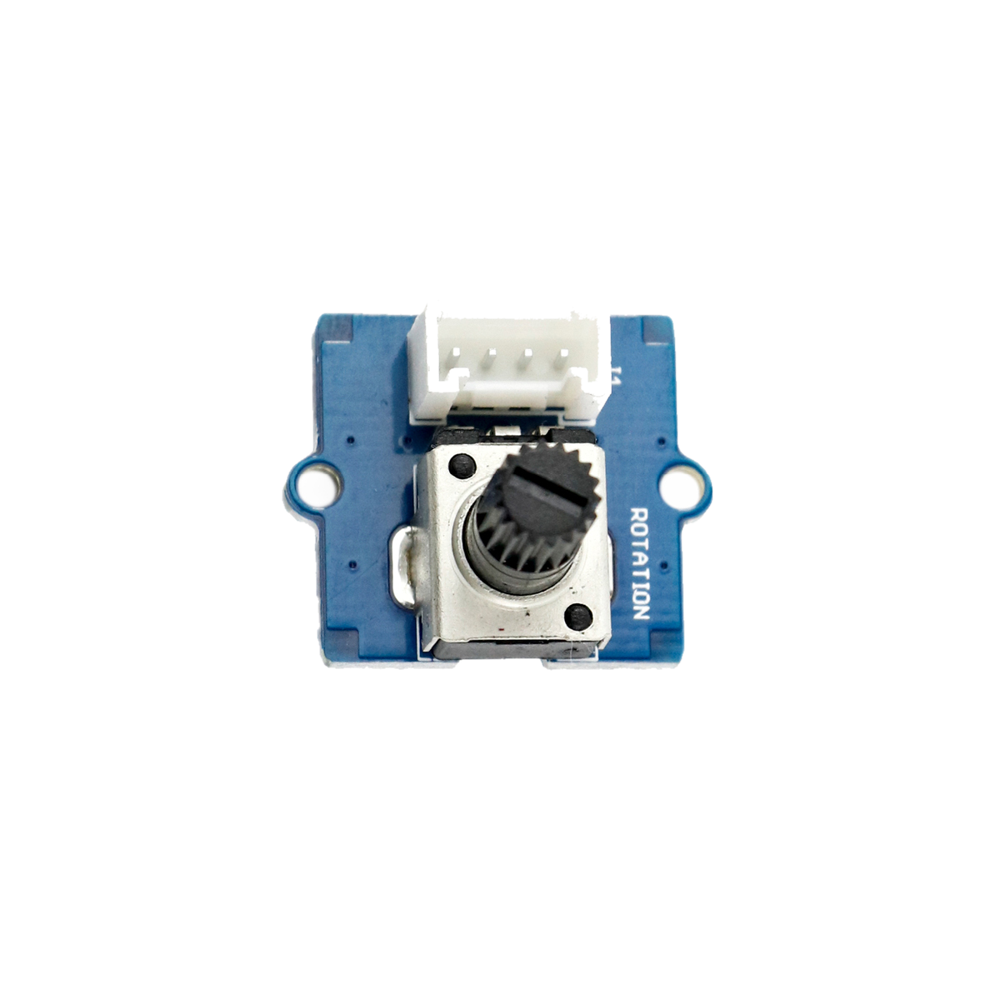

# Drehwinkelsensor

## Beschreibung
Der Drehwinkelsensor kann den Drehwinkel seiner Drehachse bestimmen. Dafür besteht der Sensor aus einem Drehpotentiometer, das abhängig des Drehwinkels die Widerstandsverhältnisse zwischen seinen Anschlüssen verändert. Durch die bereits integrierte Verschaltung als Spannungsteiler gibt das Modul an seinem Anschluss eine analoge Spannung direkt abhängig vom Drehwinkel aus. Der Sensor kann direkt oder mithilfe des Grove Shields an einen analogen Pin am Arduino angeschlossen werden.

Eine der häufigsten Anwendungen eines Drehwinkelsensors (oder Drehpotentiometers) ist die Nutzung des Sensors als Drehknopf und damit als Eingabe. Mit einem solchen Drehknopf kann so beispielsweise die Helligkeit einer Leuchte oder die Geschwindigkeit eines Motors eingestellt werden.

Alle weiteren Hintergrundinformationen sowie ein Beispielaufbau und alle notwendigen Programmbibliotheken sind auf dem offiziellen Wiki (bisher nur in englischer Sprache) von Seeed Studio zusammengefasst. Zusätzlich findet man über alle gängigen Suchmaschinen durch die Eingabe der genauen Komponentenbezeichnungen entsprechende Projektbeispiele und Tutorials.

## Beispiele

!!!show-examples:./examples/

<!-- infolist -->

## Wichtige Links für die ersten Schritte:

- [Seeed Studio Wiki](http://wiki.seeedstudio.com/Grove-Rotary_Angle_Sensor/) [- Drehwinkelsensor](http://wiki.seeedstudio.com/Grove-Rotary_Angle_Sensor/)

## Projektbeispiele:

- [Funduino Tutorials - Blinkgeschwindigkeit einer LED](https://funduino.de/nr-7-potentiometer)

## Weiterführende Hintergrundinformationen:

- [Potentiometer - Wikipedia Artikel](https://de.wikipedia.org/wiki/Potentiometer)
- [Spannungsteiler - Wikipedia Artikel](https://de.wikipedia.org/wiki/Spannungsteiler)
- [GPIO - Wikipedia Artikel](https://de.wikipedia.org/wiki/Allzweckeingabe/-ausgabe)
- [GitHub-Repository: Drehwinkelsensor](https://github.com/MakeYourSchool/21-Drehwinkelsensor)

