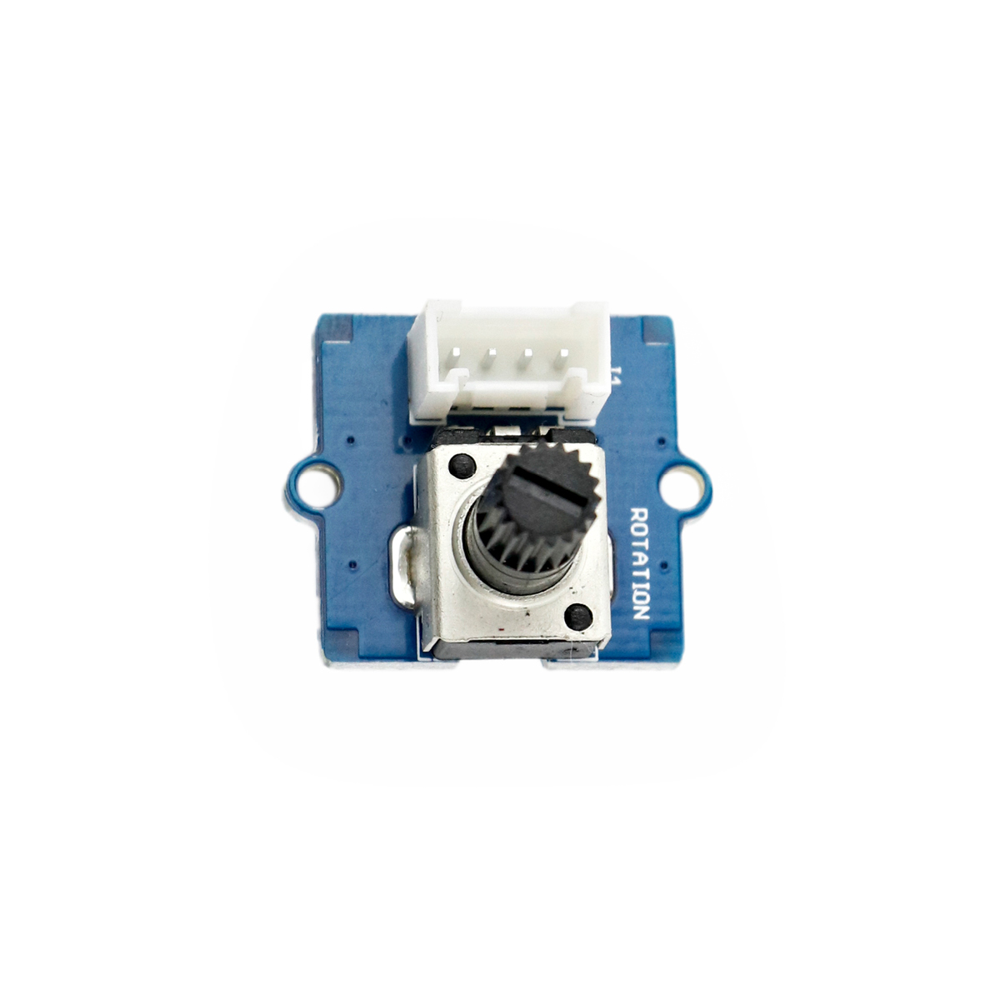

---
title: "Drehwinkelsensor"
date: "2018-10-01T13:37:36.000Z"
tags: 
  - "sensor"
coverImage: "21_drehwinkelsensor.jpg"
material_number: "21"
material_type: "sensor"
material_short_descr: "Seeed Studio Grove - Rotary Angle Sensor"
manufacture: "Seeed Studio"
manufacture_url: "https://www.seeedstudio.com/"
repo_name: "mks-SeeedStudio-Grove_Rotary_Angle_Sensor"
product_url: "https://wiki.seeedstudio.com/Grove-Rotary_Angle_Sensor/"
clone_url: "https://github.com/Make-Your-School/mks-SeeedStudio-Grove_Rotary_Angle_Sensor.git"
repo_prefix: "mks"
repo_part: "Grove_Rotary_Angle_Sensor"
embedded_example_file: "examples/Grove_Rotary_Angle_Sensor_minimal/Grove_Rotary_Angle_Sensor_minimal.ino"
---

# Drehwinkelsensor

## Beschreibung
Der Drehwinkelsensor kann den Drehwinkel seiner Drehachse bestimmen. Dafür besteht der Sensor aus einem Drehpotentiometer, das abhängig des Drehwinkels die Widerstandsverhältnisse zwischen seinen Anschlüssen verändert. Durch die bereits integrierte Verschaltung als Spannungsteiler gibt das Modul an seinem Anschluss eine \[simple\_tooltip content='Digital vs. analog: Analoge Signale können beliebige kontinuierliche Werte annehmen. Sie verändern sich stufenlos. Dadurch können theoretisch unendlich viele kleine Änderungen (und damit ein unendlicher Informationsinhalt) übertragen werden. Einschränkend wirkt die Genauigkeit, mit der das analoge Signal ausgelesen/erfasst wird. Das digitale Signal nimmt nur diskrete Werte an und springt bei einer etwaigen Änderung von einem Wert zum nächsten. Es kann nur eine definierte Anzahl an Informationsinhalten übertragen werden. Vorteilhaft ist dagegen die damit verbundene Fehlerfreiheit bei minimalsten, ungewollten Schwankungen. Oftmals werden nur zwei Werte HIGH und LOW (Ein/Aus oder 1/0) übermittelt.'\]analoge\[/simple\_tooltip\] Spannung direkt abhängig vom Drehwinkel aus. Der Sensor kann direkt oder mithilfe des Grove Shields an einen \[simple\_tooltip content='Anschlüsse / Pins / Ein- und Ausgänge: Die Mikrocontroller besitzen kleine metallische Kontakte, an die Komponenten, Shields oder andere Platinen angeschlossen werden können. Diese Kontakte werden Pins genannt und können oft als sogenannte GPIO’s (Allzweck Ein- und Ausgabe) eingesetzt werden. Dies bedeutet, dass diese Pins direkt über die Programmierung des Mikrocontrollers angesprochen werden können und hierbei sogar bestimmt werden kann, ob dieser Pin als Eingang (beispielsweise zum Auslesen eines Sensors) oder als Ausgang (beispielsweise zur Steuerung eines Motors) genutzt werden kann. Praktisches Beispiel: Wird am Arduino eine LED an Pin 1 angeschlossen, kann im Programm direkt der Pin 1 als „An“ oder „Aus“ definiert werden und damit die LED an- oder ausgeschaltet werden. '\]analogen Pin\[/simple\_tooltip\] am Arduino angeschlossen werden.

Eine der häufigsten Anwendungen eines Drehwinkelsensors (oder Drehpotentiometers) ist die Nutzung des Sensors als Drehknopf und damit als Eingabe. Mit einem solchen Drehknopf kann so beispielsweise die Helligkeit einer Leuchte oder die Geschwindigkeit eines Motors eingestellt werden.

Alle weiteren Hintergrundinformationen sowie ein Beispielaufbau und alle notwendigen Programmbibliotheken sind auf dem offiziellen Wiki (bisher nur in englischer Sprache) von Seeed Studio zusammengefasst. Zusätzlich findet man über alle gängigen Suchmaschinen durch die Eingabe der genauen Komponentenbezeichnungen entsprechende Projektbeispiele und Tutorials.

<!-- infolist -->

<!-- infolists -->
## Wichtige Links für die ersten Schritte:

- [Seeed Studio Wiki](http://wiki.seeedstudio.com/Grove-Rotary_Angle_Sensor/) [- Drehwinkelsensor](http://wiki.seeedstudio.com/Grove-Rotary_Angle_Sensor/)

## Projektbeispiele:

- [Funduino Tutorials - Blinkgeschwindigkeit einer LED](https://funduino.de/nr-7-potentiometer)

## Weiterführende Hintergrundinformationen:

- [Potentiometer - Wikipedia Artikel](https://de.wikipedia.org/wiki/Potentiometer)
- [Spannungsteiler - Wikipedia Artikel](https://de.wikipedia.org/wiki/Spannungsteiler)
- [GPIO - Wikipedia Artikel](https://de.wikipedia.org/wiki/Allzweckeingabe/-ausgabe)
- [GitHub-Repository: Drehwinkelsensor](https://github.com/MakeYourSchool/21-Drehwinkelsensor)

